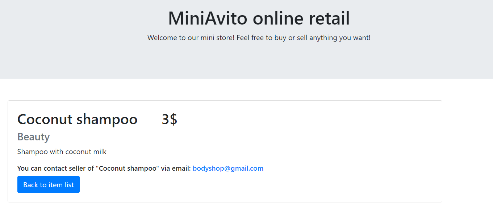

# Bulletin board store App

This project is implemented with [Flask](http://flask.pocoo.org), [Redis](http://redis.io)
and [Docker](http://docker.com)

In the web application you can put your own items on sale or buy something you like.

## App Overview

From the main page of the store you can scroll through items available for purchase or put your own item for sale.


By clicking 'Add item' you will open a form for your item where you can select category, add name and discription and
set price. Don't forget to leave your email to contact customers. After hitting 'Put on sale' your item will be
available for purchase from the main store page.


To buy an item just simply click on 'Buy' button to the left of the selected product. You will get the message with
seller email.


## Quickstart

Make sure you have Docker installed.

Clone the repository, cd into it and run

```bash
sudo docker-compose build
sudo docker-compose up -d
```

You can access the store main page at http://localhost:5000.

## Docker containers

For each component of this project a separate docker container is afforded, controlled by docker-compose.

The are two containers in this project:

* server: where are Flask web application runs
* redis: containing the Redis server

The image is build from `project/Dockerfile`. This Dockerfile includes all the necessary python components and
dependencies from `project/requirements.txt`.

For the redis server container the docker-hub [redis](https://hub.docker.com/_/redis) image is used.

## docker-compose.yml

docker-compose.yml defines a service made up of two containers: `server` and `redis` and additional settings that make
up an docker-compose application.

```yaml
services:
  server:
    build: ./project
    image: master-image
    ports:
      - 5000:5000
    command: gunicorn --workers 4 --bind 0.0.0.0:5000 --timeout 120 'server:create_app()'

  redis:
    image: redis
```
